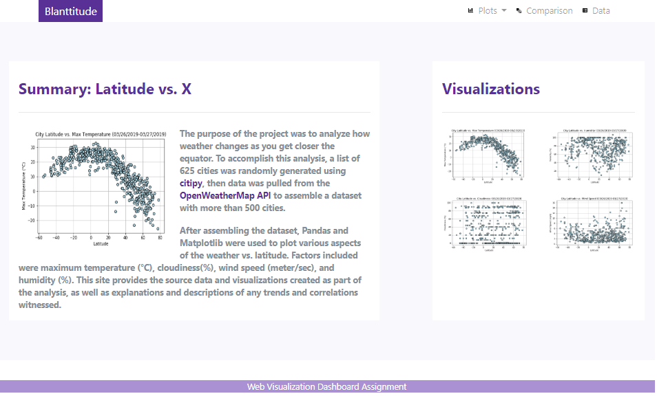
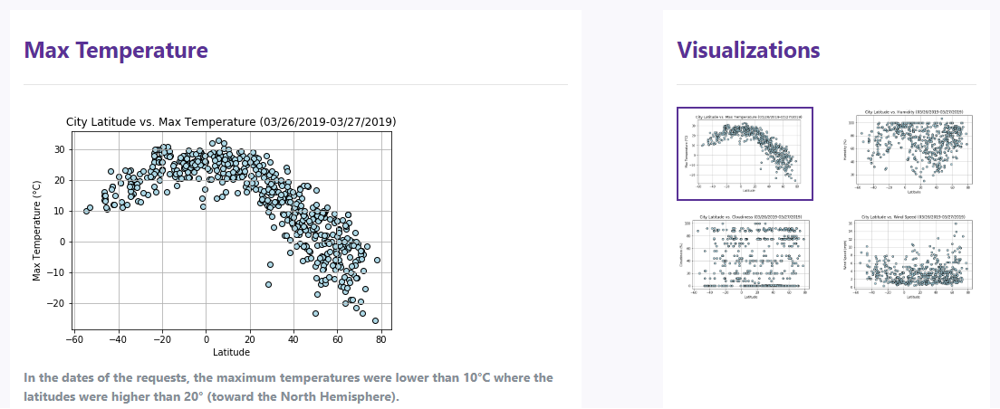
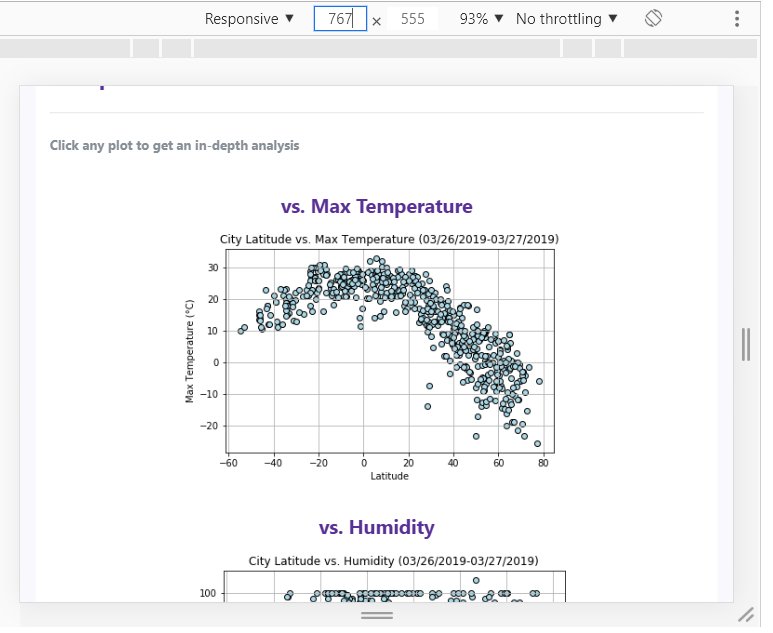
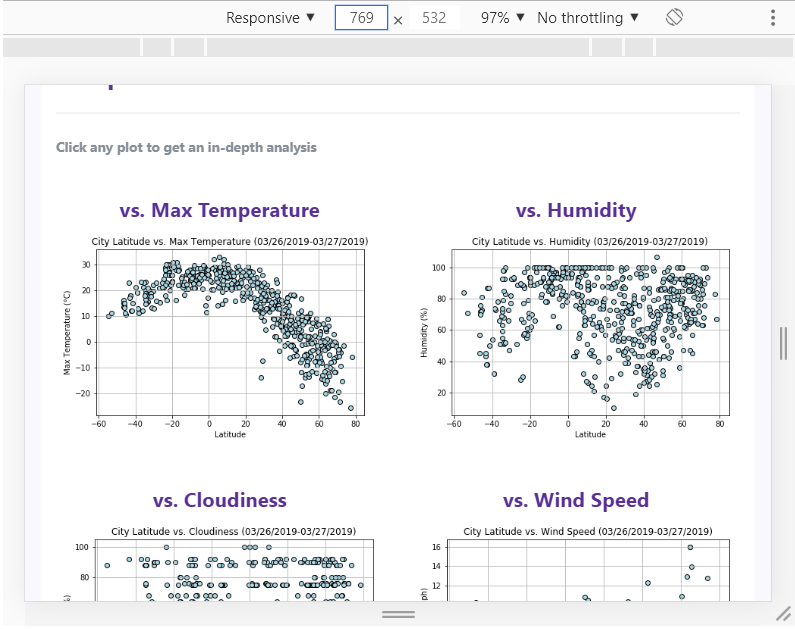
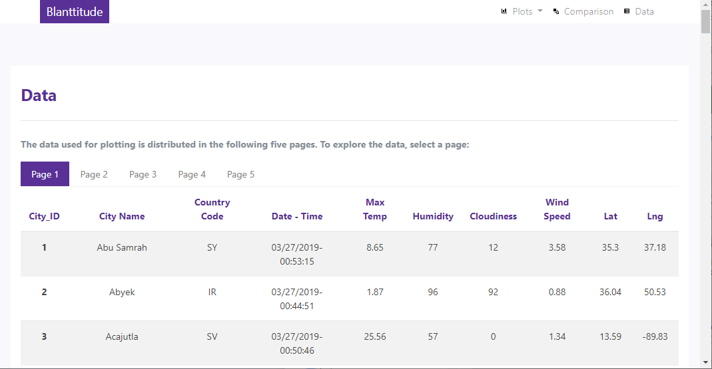
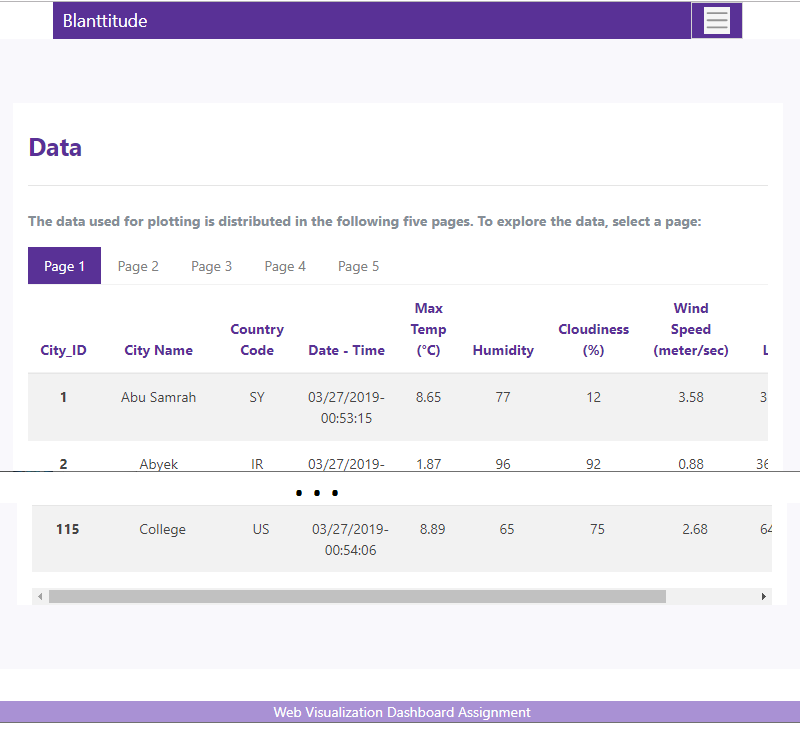
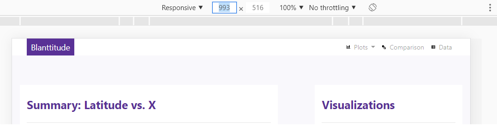
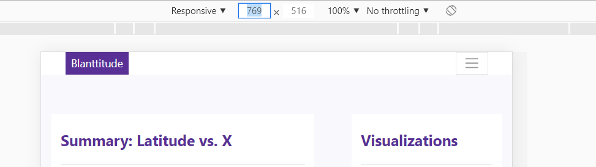
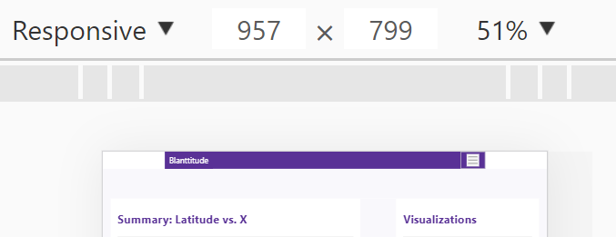
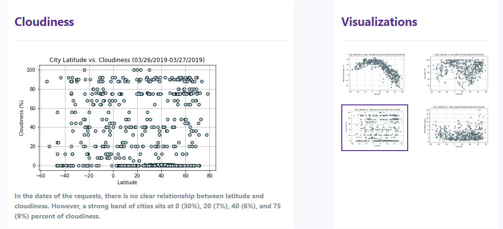

# Web Visualization Dashboard (Latitude) Assignment

## Background

Create a dashboard for the Weather data analysis, with HTML 5, CSS, and Bootstrap 4.0.

## Blanttitude - Latitude Analysis Dashboard with Attitude

This dashboard website uses the visualizations created in the [PyWeather - APIs assignment](https://github.com/bkachava/pandas/tree/master/PyWeather).

### Website Features

The [website](https://github.com/bkachava/) consists of 7 pages total:

* A <strong>landing page</strong> containing of an explanation of the project and links to each visualizations page.

  

* Four <strong>visualization pages</strong>, each with a descriptive title and heading tag, the plot/visualization itself for the selected comparison and a paragraph describing the plot and its significance.

  

* A <strong>Comparisons page</strong> that contains all the visualizations on the same page and uses a bootstrap grid for the visualizations, considering the following: 

  - Two visualizations across on screens medium and larger
   
  - One across on extra-small and small screens.
   

* A <strong>Data page</strong> that displays a responsive table (a bootstrap table component) containing the data used in the visualizations. The data come from exporting the [cities_dt.csv](Resources/cities_dt.csv) file as HTML, using [ConvertCSV](http://www.convertcsv.com/csv-to-html.htm). The table  

  - On larger screens. As described above.
   
  - On extra-small, small and medium screens. Notice the horizontal scroll bar below the last displayed row.
   

Also, at the top of every page, there is a responsive <strong>navigation menu</strong> (using media queries) that on the left, has the name of the site which allows users to return to the landing page from any page, and on the right, contains a dropdown named "Plots" which provides links to each individual visualization page, the option "Comparisons" which links to the comparisons page, and the option "Data" which links to the data page. The Navigation Menu has the following behavior:

- On larger screens. As described above.
   
- On medium screens. Notice the collapsed options to the right.
   
- On extra-small and small screens. Notice the background color changed and the collapsed options to the right.
   

### Bonuses

Additionally, the website:

* Uses the dataset assembled for the [PyWeather - APIs assignment](https://github.com/bkachava/pandas/tree/master/PyWeather). However, the timestamps were changed to show the date and the time in a proper format. The code created to do this task is in the folder Notebook.
* Uses a bootstrap theme named [Pulse] (https://bootswatch.com/pulse/).
* Uses meaningful glyphicons next to links in the header. See [Open Iconic](https://useiconic.com/open/) to find out more.
* Have visualization navigation on every visualizations page with an active state.
 
