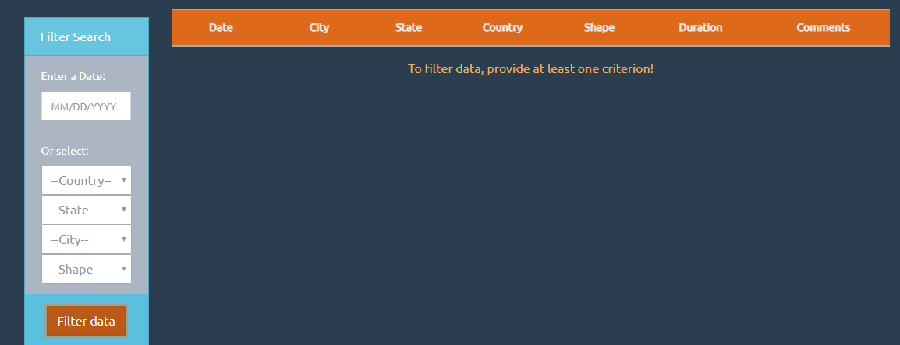
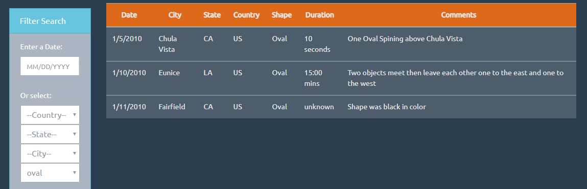

# JavaScript and DOM Manipulation Assignment

Search for UFO sightings using the criteria defined for each level.

## Level 1: Automatic Table and Date Search

- The first time UFO sightings are displayed.

- Main elements

   * Table

     Some transformations were included for the data: Uppercasing (country and state), Capitalizing (city and shape), and Parsing HTML (comments).
   
    

   * Filters
    
    

     For this level, the user can provide a valid date (e.g. 01/05/2010, 1/5/2010, 01/13/2010, 1/13/2010) to filter data. 
     
     A calendar is shown, when the user try to enter a date.

    

   * Buttons
   
   __Filter data__. Let the user search in the dataset with different criteria.
   
   __Show all data__. Let the user clear all the filters and show all the dataset.

## Level 2: Multiple Search Categories

- Filters
    
   * For this level, the user can select a country, a state, a city or a shape. These selections, along with the date, will be used to filter data. `Note that all the values provided by the user, must be present in a element of the dataset for it to be included in the table`. 

    

   * When the page is loaded, the Country and Shape lists are filled with options representing the unique values found in the dataset.

    __Country__

    
   
    __Shape__
    
    

   * For the country, the states and the cities filters __some rules__ were applied. 

     If the user selected a specific country (e.g. CA), the list of states will be filled with the unique values found in the dataset for this country. 

    

    `Note that if the user selected the first value of the list of countries --Country-- the options created for the states are removed.`

     If the user selected a specific state (e.g. ON), the list of cities will be filled with the unique values found in the dataset for this state. 

    

    `Note that if the user selected the first value of the list of states --State-- the options created for the cities are removed.`

- Messages

     A message is displayed, in case the user clicked the button __Filter data__ and did not provided a date (or any other criteria. See Level 2).

     

     A message is displayed, in case the user provided a valid date, and/or select an element, and clicked the button __Filter data__ but there were no coincidences in the dataset.

     

- Search examples

  * A new dataset is displayed, when the user clicked the button __Filter data__ and enter a valid date.

  

  * A new dataset is displayed, when the user clicked the button __Filter data__ and selected a country and a state.

  

   * A new dataset is displayed, when the user clicked the button __Filter data__ and selected a country, a state, and a city.

  

  * A new dataset is displayed, when the user clicked the button __Filter data__ and selected a shape.

  

  * A new dataset is displayed, when the user clicked the button __Filter data__ and selected all the criteria.

  
