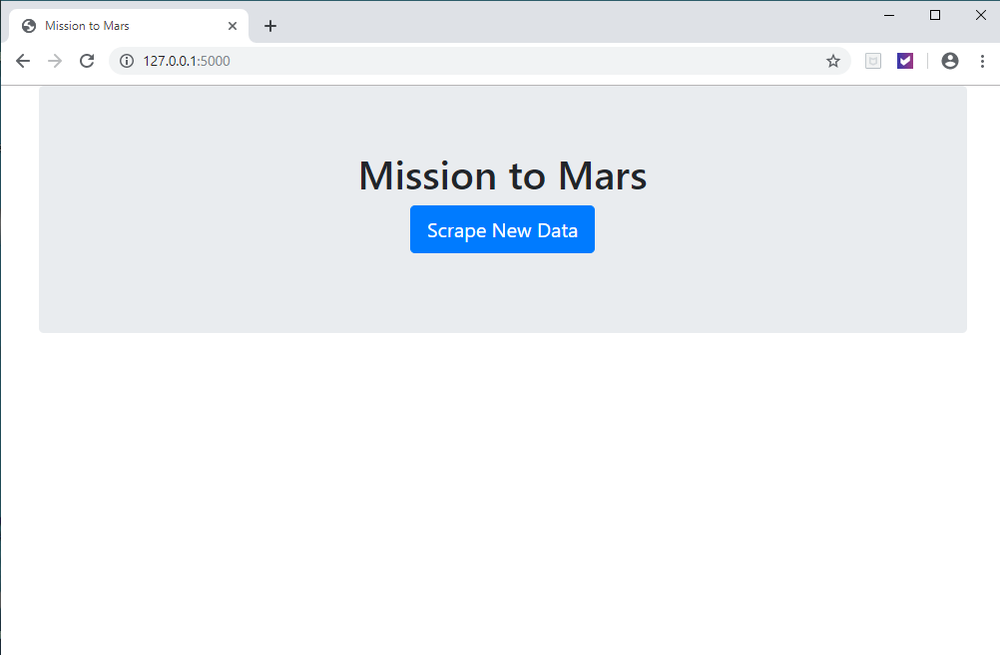
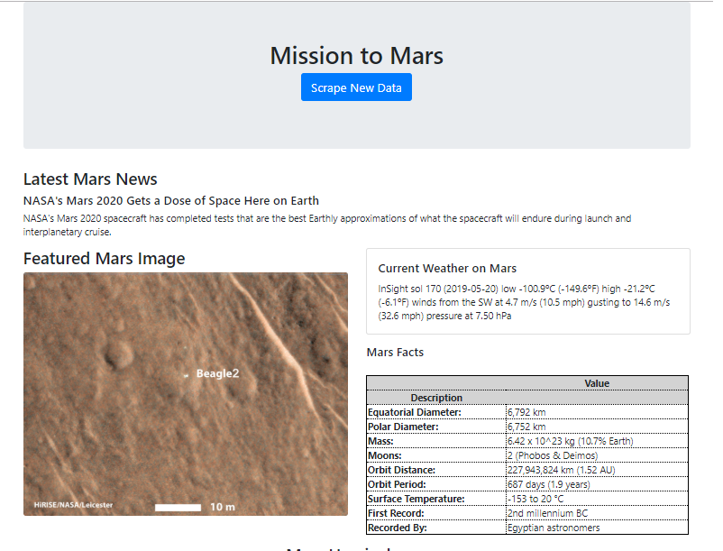
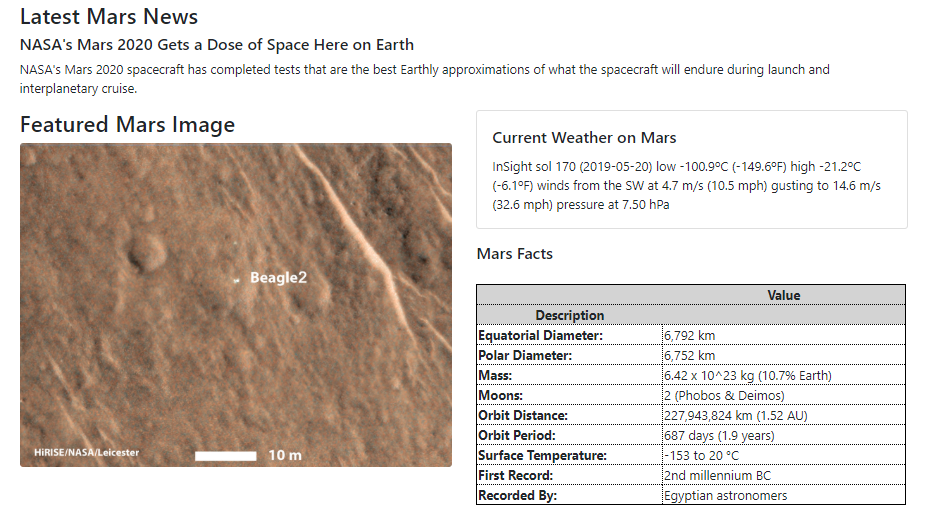
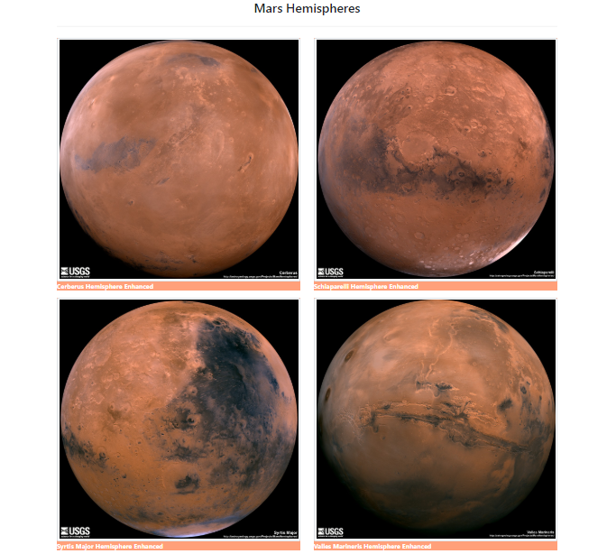
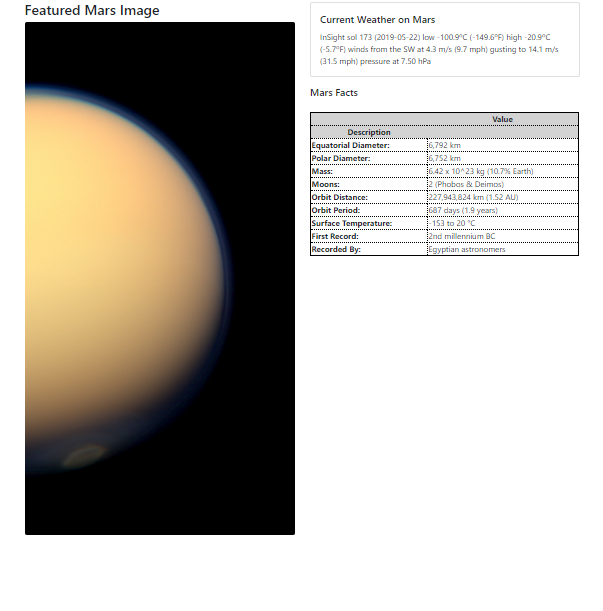

# Mission to Mars Assignment

## Step 1 - Scraping

### NASA Mars New
    
	Scrape the NASA Mars News Site and collect the latest News Title and Paragraph Text.

### JPL Mars Space Images - Featured Image

    Find the full size image url for the current Featured Mars Image.

### Mars Weather

    Visit the Mars Weather twitter account and scrape the latest Mars weather tweet from the page.
		
### Mars Facts

    Visit the Mars Facts webpage and use Pandas to scrape the table containing facts about the planet 
    including Diameter, Mass, etc.

### Mars Hemispheres
	
    Visit the USGS Astrogeology site to obtain high resolution images for each of Mars Hemispheres.

	
Here is the Jupyter [Notebook](../Notebook) containing the scraping code used.

## Step 2 - MongoDB and Flask Application

### Screenshots of the final application

- When there is __no information__ in the database

- After selecting the button __Scrape New Data__

- _Layout for NASA Mars New, Featured Mars Image, Current Weather on Mars, and Mars Facts__ 

- __Layout for Mars Hemispheres__

- After selecting the button __Scrape New Data__ again!

