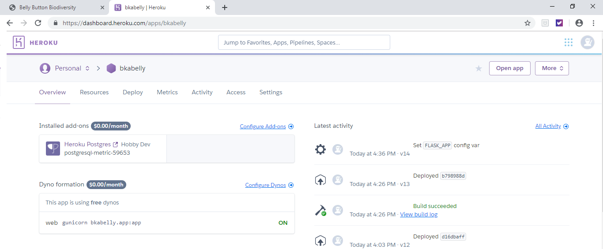

# Plotly Assignment

__Belly Button Biodiversity Dashboard__

## Step 1 - Plotly.js

Use Plotly.js to build interactive charts for the dashboard.

__Main elements__

- Display key/value pair from the sample metadata JSON object. Data from the route (`/metadata/<sample>`)
  to display each selected sample.

- Pie chart. Data from the samples route (`/samples/<sample>`) to display the top 10 Operational 
Taxonomic Units. The Sample ID was added to the chart, in case the user wanted to download the 
plot as a png.

* Hover

- Bubble Chart. Data from the samples route to display each sample. The Sample ID was added to the 
chart, in case the user wanted to download the plot as a png.

* Hover

- Update all of the plots any time a new sample is selected.

* When the page loads the first __sample__ is set to __940__.

* After select the __sample 1524__, the metadata and the graphs are updated.

## Step 2 - Heroku

Deploy your Flask app to Heroku. After testing the application locally, the code was refactored and the
required files, to deploy to Heroku, were created.

   

Link to the app [bkabelly] (https://bkabelly.herokuapp.com/)

## Advanced Challenge Assignment

- Gauge Chart

* Adapt the [Gauge Chart] (https://plot.ly/javascript/gauge-charts/) to plot the Weekly Washing 
Frequency obtained from the `/metadata/<sample>` route. The Sample ID was added to the chart,
in case the user wanted to download the plot as a png. 

   

* Update the chart whenever a new sample is selected.

   See examples for __samples 940 y 1524__ above.

- Flask API

Use Flask API to serve the data needed for the plots. Use the buttons after the text __Or use the API to get the data__.

   

* Names

   

   

* Metadata for a sample

   

   
   

* Specific sample

   

   

## Notes

Additionally, the dashboard:

* Uses a bootstrap theme named [Minty] (https://bootswatch.com/minty/).

* The charts have the same colors than the bootstrap theme and not the defaults provided by Plotly.

* Uses a Heroku Postgress database with the data provided in the SQLite database. For this part, the schemas and the data from the SQLite database were extracted and then created in Postgress using pgAdmin.

   